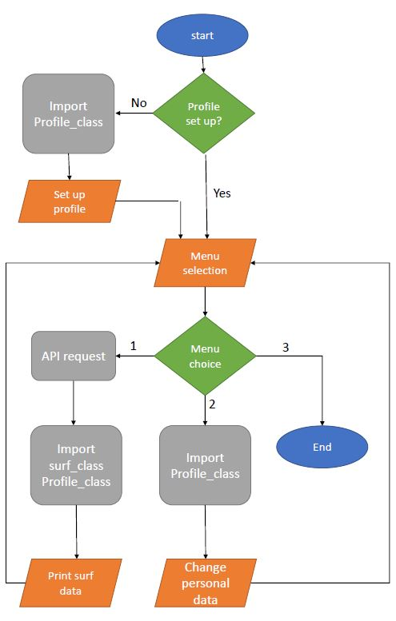
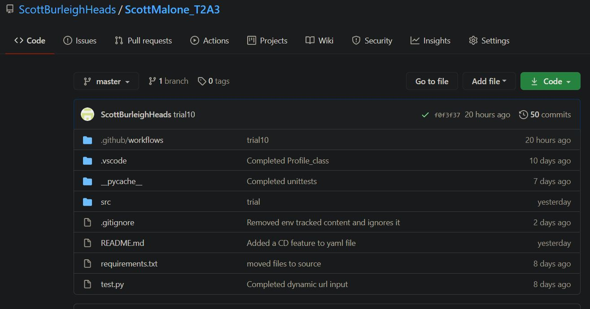
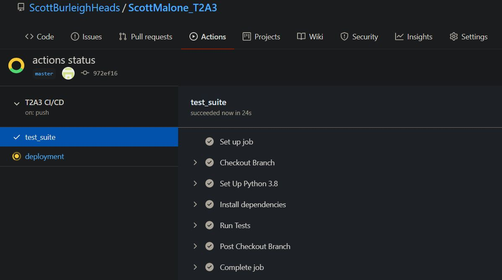
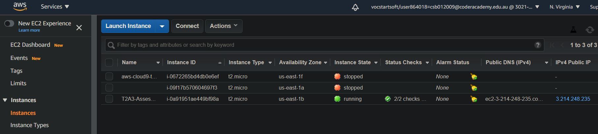
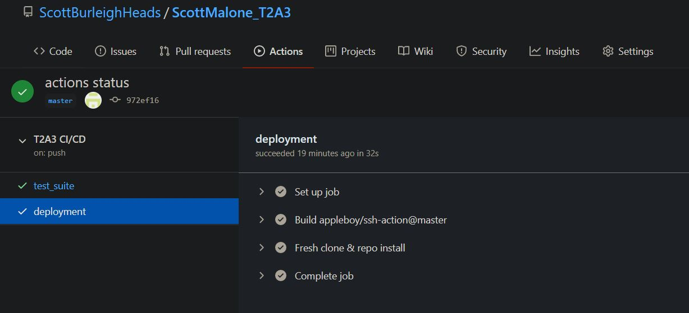
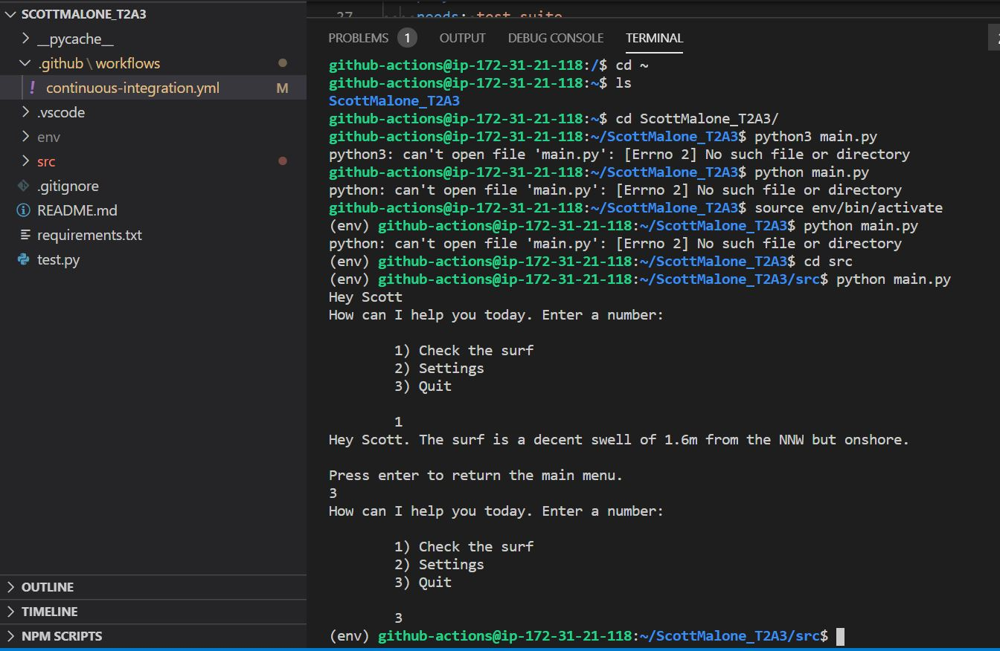

### Scott Malone T2A3 - Develop and Implement an Algorithm in Python
**R1:** 

1)

This program is used to interact with the user. It is a personal AI friend that checks the surf using an Application Programming Interface and returns the size of the surf and weather conditions. Depending on the results the program will act differently which means it will return a different string with the API data. The strings that are returned will advise to go for a surf, if the surf conditions are bad but the weather is good it will suggest to go for a paddle board or if the weather is terrible and no surf to go to the gym. 

Starting the program for the first time the program will ask the user to set up a profile. Once the profile is set up it stores the data in a txt file for later use and will no longer ask a user to set up a profile next time the program is restarted. Setting up the profile will ask for a name, D.O.B and address. The program will utilise the name by refering to the user by name when interacting with the user giving a more personalised user experience. The program will utilise the address with the API. I developed a dynamic get request where based on the users address it will decide the location of the surf report. Also a settings feature was established to change the profile. If the profile changes the get request will change returning different results.

The layout of the program is simple. Once activating the program the user will be taken to a menu where there is a selection of choices to choose from. 
1) Check the surf
2) Settings 
3) Quit

Designing the code it was required to utilise objects and classes to meet requirements. I broke up the program into different components written in classes then importing them into the main. I decided that the main did not need to be a class due to the fact there is no repeat code nor is there a need to write an object for the main. Therefore it was concluded un-necessary.

The Profile_Class was used as a blueprint for a user to create an object that collects input from the user and stores the data in a txt file. Once the profile is set up the Profile_Class has a method that will get the data and transform it back into useable data.  

The Surf_class was designed to get the API information and manipulate the information so it can be used as output to print on the terminal screen. The surf_class has the AI feature that will return different strings depending on the results using if, elif and else statements. 

examples:

If there is surf the string that may be returned is "decent swell of {self.surf_size}m and offshore winds from the {self.wind_direction}. Get out there now"

If there is no surf and windy you may get a string return "pretty small with a swell of {self.surf_size}m and onshore winds from the {self.wind_direction}. Better off going to the gym."

If there is no swell but water temp is ideal with minimum wind you will get "pretty small with a swell of {self.surf_size}m and onshore winds from the {self.wind_direction}. Better off going to the gym. The wind is only {self.wind_speed}km/h and the water temp is a nice {self.water_temp}C. Go for a paddle board."

2)
**Control flow:**

###Technical information to meet requirements
**Initiating the program**

From directoy ScottMalone_T2A3

    run: source env/bin/activate
    run: cd src 
    run: python main.py

There may be data already in ScottMalone_T2A3/src/profile.txt which means the set up profile may not initiate. You can delete the file or data in it and it should run a set up profile feature. Otherwise you can change the profile in settings.
 
**Input and Output examples:**

##### From surf_class:

**Inputs:**

user name: Scott Pot
wave height = 0.5
wind direction = N
wind speed = 10
water temp = 21

**Output:**

Hey Scott. The surf is pretty small with a swell of 0.5m and onshore winds from the N. Better off going to the gym. "The wind is only 10km/h and the water temp is a nice 21C. Go for a paddle board.")

**Input:** 

    user name: Scott Pot
    wave height = 1.5
    wind direction = W
    wind speed = 25
    water temp = 21

**Output:**

    Hey Scott. The surf is pretty small with a swell of 0.5m and onshore winds from the N. Better off going to the gym. Its a bit windy to go paddle boarding. The wind is 20km/h.

##### Profile_test:

**Input:**

    Inputs are taken from the user and saved in an object save in the main.

**Output:**

    Name  : Bob Lob
    D.O.B : 23/32/2332
    City  : Maroubra, Sydney, Randwick City Council, New South Wales, 2035, Australia
    City coordinates: -33.9453441,151.2456824

**Using the API:**
File location: \ScottMalone_T2A3\src\Surf_class.py

The program was designed with a "two way flow of communication". To meet these requirements I developed a program to utilise pythons request module. The function requests.get() sends a get request to worldweatheronline.com. 

        url = f'http://api.worldweatheronline.com/premium/v1/marine.ashx?key=e76a15e1269541aab92105556202109&format=xml&q={coordinates}&tides=yes'
        response = requests.get(url)
        soup = BeautifulSoup(response.text,"html.parser")

When sending the get request I recieved back a html file which I needed to use the python beautiful soup module. Once building the code to utilise the data I realised there was a JSON file option which I decided against using considering I had functioning code.

**Automated Testing:**

File location: \ScottMalone_T2A3\src\Tests

To test the code go to enter the src directory: 

        File address: \ScottMalone_T2A3\src
        run: python -m unittest discover -s Tests -v

You will find there are two tests designed for Surf_class and Profile_class. They are named test_Profile.py and test_Surf.py. 

**test_Surf:**

In test_Surf I have used manual inputs and tested that they return the correct str. I designed a function called value_input to assist in data input for the assertion function tests.

Example: 

        self.assertEqual(Test_Surf.value_input(0.5,"N",10,None).surf_str_entry,"pretty small with a swell of 0.5m and onshore " 
        "winds from the N. Better off going to the gym.")

**test_Profile**

In test_profile I set up a mock because data needed to be input from the user. Using the mock variables I was able to compare function output and recieve a positive test. Setting the mock up it was required to import a python module displayed below. 

    from unittest.mock import patch

        def setUp(self):
                with patch("builtins.input") as input: 
                    input.side_effect = ["scott malone","23/32/2332","sydney","yes"]
                    self.test = Profile()
                    self.test.set_up_profile_name_DOB
                    self.test.set_up_profile_address
                    self.test.save_profile

**Version control**

Git was initialised locally then pushed to the repositories below on Github.com. 
.gitignore is used so certain files are not pushed to github.

Github repository: 

    http: https://github.com/ScottBurleighHeads/ScottMalone_T2A3.git
    SSH: git@github.com:ScottBurleighHeads/ScottMalone_T2A3.git

**Continuous Integration**

    yaml file location: ScottMaloneT2A3\github\workflows\continuous-integration.yml

Firstly a job had to be coded in yaml so github could interpret the file and follow the instructions. It needed to be saved in the directory .github so github could recognise it. Once set up all that was required was a git push then it was automated.

    Required integration code from the yaml file:
    jobs:
    test_suite:
        runs-on: ubuntu-latest
        steps:
        - name: Checkout Branch
            uses: actions/checkout@v2
        - name: Set Up Python 3.8
            uses: actions/setup-python@v2
            with:
            python-version: 3.8
        - name: Install dependencies
            run: |
            python -m pip install --upgrade pip
            if [ -f requirements.txt ]; then pip install -r requirements.txt; fi
        - name: Run Tests
            run: |
            cd src
            python3 -m unittest discover Tests

**Continuous Deployement**

To set up continuous deployment it was required to set up a server on AWS educate and get an elastic ip address. 

Once the server was established it is required to ssh into the terminal.

    run: ssh -i duck.pem ubuntu@3.214.248.235

Also it is required to add another job to github actions.

    deployment:
        needs: test_suite
        runs-on: ubuntu-latest
        steps:
        - name: Fresh clone & repo install
            uses: appleboy/ssh-action@master
            with:
            host: 3.214.248.235
            username: github-actions
            key: ${{ secrets.SSH_KEY }}
            port: 22
            script: |
                rm -rf ScottMalone_T2A3
                git clone https://github.com/scottBurleighHeads/ScottMalone_T2A3.git
                python3.8 -m venv /home/github-actions/ScottMalone_T2A3/env
                source /home/github-actions/ScottMalone_T2A3/env/bin/activate
                pip install -r /home/github-actions/ScottMalone_T2A3/requirements.txt

**Evidence of the pushed and automated files.**

In the first photo it is from github confirming approval of the deployment.

In the second photo after logging into the server I was able to run my program.

### Modules and requirements

**Pip requirements:**

    They can be found in ScottMalone_T2A3/requirements.txt

    attrs==20.2.0
    beautifulsoup4==4.9.1
    bs4==0.0.1
    certifi==2020.6.20
    chardet==3.0.4
    click==7.1.2
    click-plugins==1.1.1
    cligj==0.5.0
    Fiona==1.8.17
    geographiclib==1.50
    geopandas==0.8.1
    geopy==2.0.0
    idna==2.10
    munch==2.5.0
    numpy==1.19.2
    pandas==1.1.2
    pygeocoder==1.2.5
    pyproj==2.6.1.post1
    python-dateutil==2.8.1
    pytz==2020.1
    requests==2.24.0
    Shapely==1.7.1
    six==1.15.0
    soupsieve==2.0.1
    urllib3==1.25.10

#### Mudules specifically imported by me:

##### bs4,beautifulsoup4==4.9.1: (Used in Surf_class)

    from bs4 import BeautifulSoup

This was used to scrape the html file for the data from API worldweatheronline.com

##### geopy==2.0.0 (Used in Profile_class)
    
    from geopy.geocoders import Nominatim

This was used to determine the latitude and longitude given from input a suburb or city. It was required for the dynamic API request.

##### requests==2.24.0 (Used in Surf_class)
    
    import requests 

Used to send a request to import the function requests.get() and use it to recieve data from worldweatheronline.com  

##### Built in modules

    from datetime import datetime

The API I had information from changed depending on what time of the day it was. I was able to utilise the datetime import to give information depending on the time. 

    from unittest

unittest was used in the test cases test_Surf.py and test_Profile.py. It was crucial for setting up automated test in github-actions

#### Conclusion

I have added comments and docstrings to all the source code in ScottMalone_T2A3/src to search for further and particular descriptions on methods.

